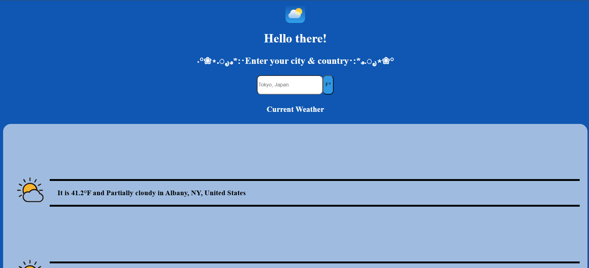

# 🌦 Project: Weather API

### Goal: Enable your user to enter a city + country and return the temperature in Fahrenheit

# Weather App

  

A clean, responsive weather application that helps users quickly check current conditions and short-term forecasts for any city.

**🎮 Live Demo:** [https://naima-bogran-weatherapp.netlify.app/](https://naima-bogran-weatherapp.netlify.app/)

---

## ✨ Features

* **Responsive Design:** A clean, mobile-first design that looks great on any device, from phones to desktops.
* **Search by City & Country:** Enter City, Country, or just city to get the current weather status.
* **Friendly UI:** Clean typography and accessible form controls.

## 🛠️ Tech Stack

* **Frontend:** HTML5, CSS3 (Flexbox/Grid), Vanilla JavaScript (ES6+)
* **APIs:** OpenWeatherMap for current conditions and forecasts.
* **Deployment:** Netlify

